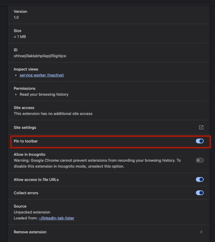

# LinkedIn Tab Manager

A Chrome extension to list and close LinkedIn tabs.

## Installation

1. Open Chrome and go to `chrome://extensions/`
2. Enable "Developer mode" (toggle in the top-right corner)
3. Click "Load unpacked" and select this folder
4. **Pin to Toolbar**: 
   - On the extensions page, find the "LinkedIn Tab Manager"
   - Toggle the "Pin to toolbar" option to ON (as shown in the screenshot below)
   - The extension icon will appear in your Chrome toolbar for easy access



## Features

### 1. Popup Interface
- Click the extension icon in the toolbar to open a popup with all LinkedIn tabs
- Click on a tab in the list to switch to it
- Click the "Close" button next to a tab to close it

### 2. Background Monitoring
The extension also automatically logs LinkedIn tabs to the background console when installed.

To view the console output:
1. On `chrome://extensions/`, find "LinkedIn Tab Manager"
2. Click "Inspect views" > "service worker"
3. In the DevTools that opens, go to the "Console" tab

### 3. Manual Trigger (Optional)
If you want to use the manual trigger version:
1. Rename `background_with_trigger.js` to `background.js` (replace the original)
2. Reload the extension in `chrome://extensions/`
3. Open the service worker console as described above
4. Type this command to trigger the tab listing:
   ```javascript
   chrome.runtime.sendMessage({action: "listLinkedInTabs"});
   ```

## Notes
- The extension needs the "tabs" permission to access tab information
- It only works with tabs from domains matching "*://*.linkedin.com/*" 